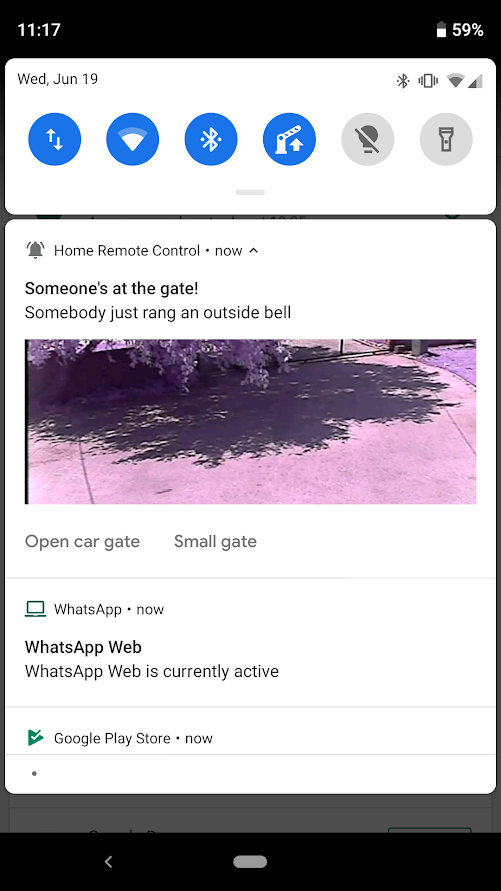

# Smart-Home
This is a repository containg old version of Aarduino and Raspberry Pi programs I previously used in my home automation system. 

The Android App is still updated, and it's open source, but it's also available on [Google Play Store](https://play.google.com/store/apps/details?id=org.no_ip.wqwdpxd.homeautomationwear_php), but only for my personal use currently. 

The rest of the code for my smart home project can be found in the [new repository](https://github.com/wqwdpxd/Smart-Home-MQTT)

### Software and services currently used for this project
 - Android Studio (Android Phone and Wear OS app)
 - Firebase Real-time database
 - Firebase cloud messaging
 - NodeRED
 - Mosca MQTT broker
 - Arduino IDE
 
## Android App features

These are some of the features of the Android App:

### Login screen
Fully functional login screen, storing user credentials and data in a Firebase Database

### Control screen
A basic control screen, design is stilla work in progress, but backend is fully implemented. If you have a working internet connection actions are almost instant, meaning that, for example, light turns on within about 200ms when you press a button.

### Web interface
Basically a NodeRED dashboard displayed in app. More functions and better design, but slow to load, therefore this will be removed once the in-app control screen is finished.

### Notifications
Currently, the only implemented notification is the one that activates when someone rings a bell, showing you the preview image from a security camera pointing at the bell. You can enable/disable this notification in-app or by disabling dedicated notification channel in Android O and later.

Clicking on a notification opens up a quick preview with basic options to open the gate. Everything works, but the design is not finished yet.

### Widgets
Currently, there are 2 basic widgets, one only for opening/losing the car gate, and one also including my room light switch. The widget allows you to simply open the gate from your home screen without opening the app, which is what we use the app for the most.

### Quick settings Tiles
Similar to widgets, currently 2 tiles are available, one for light and one for gate. As opposed to widgets, the tiles reflect the actual current state of these nodes and update when clicked or the node is changed from another source.

The tiles are only available if you are logged in and have an active internet connection, otherwise they are disabled. 

  

The tiles can be very useful if made easily accessible

### Other
Other features include:
 - Quick settings
 - App shortcuts
 - Notification channels
 - App sidebar
 - Adaptive icon
 - Wear OS companion app
 - Wear OS quick tile
 
 
    
